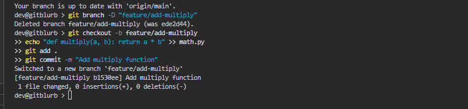

# gitblurb

A CLI tool that analyzes your git diff and generates structured, context-aware pull request descriptions using Claude AI. Designed to eliminate the manual overhead of writing PR metadata without sacrificing quality or specificity.



## Installation

1. Download `gitblurb.exe` from [Releases](https://github.com/hkeycc/gitblurb/releases)
2. Add it to your system PATH
3. Run from any git repository root

## Usage
```bash
gitblurb              # diffs HEAD against main
gitblurb master       # diffs HEAD against master
gitblurb dev          # diffs HEAD against dev
```

## Output

gitblurb generates:
- An imperative-mood PR title (≤72 characters)
- A bullet-point summary of modified files, functions, and logic
- Motivation context inferred from the diff
- Testing guidance based on changed code paths

## How it works

gitblurb reads your local git diff, sends it to a secure backend, and proxies it to the Anthropic API. Output is printed to stdout and copied to your clipboard automatically.

## Free tier

20 uses included. No API key or account required. Paid plans coming soon.

## Requirements

- Windows x64
- Git ≥ 2.x on PATH
- Must be run from a valid git repository root

## Support

Open an issue on this repository.
